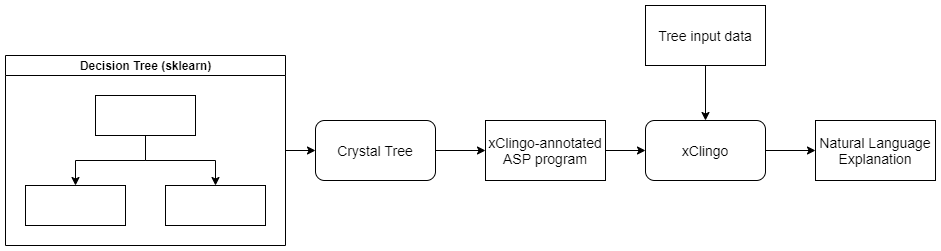

# crystal-tree

The goal of crystal-tree package is to provide simple natural language explanations for the predictions from decision trees. 

This simple python package provides an object for translating a (for now [scikit-learn](https://scikit-learn.org/stable/)'s) decision tree into an explainable logic program for [xclingo](https://github.com/bramucas/xclingo).



## Install
*Use python3*

* Download/clone the repository
* Move into the repository directory
* Then:

```
python -m pip install .
```

## Usage

```python
from sklearn.datasets import load_iris
from sklearn.tree import DecisionTreeClassifier

from crystal_tree import CrystalTree

def setup_labels(tree):
    tree.add_trace(Trace("%_instance is iris-virginica", "prediction", target_class=0))
    tree.add_trace(Trace("%_instance is iris-versicolor", "prediction", target_class=1))
    tree.add_trace(Trace("%_instance is iris-setosa", "prediction", target_class=2))

# Loads dataset
X, y = load_iris(return_X_y=True)

# Trains decision tree
clf = DecisionTreeClassifier()
clf.fit(X,y)

# Translates the classifier into an explainable logic program
crys_tree = CrystalTree(clf)

# Creates the labels used by the tree
# if skipped, default labels will be used
setup_labels(crys_tree)

# Print explanations of input X
crys_tree.explain(X)

# Write the explainable tree into files
# crys_tree.to_annotated_logic_program()
```
